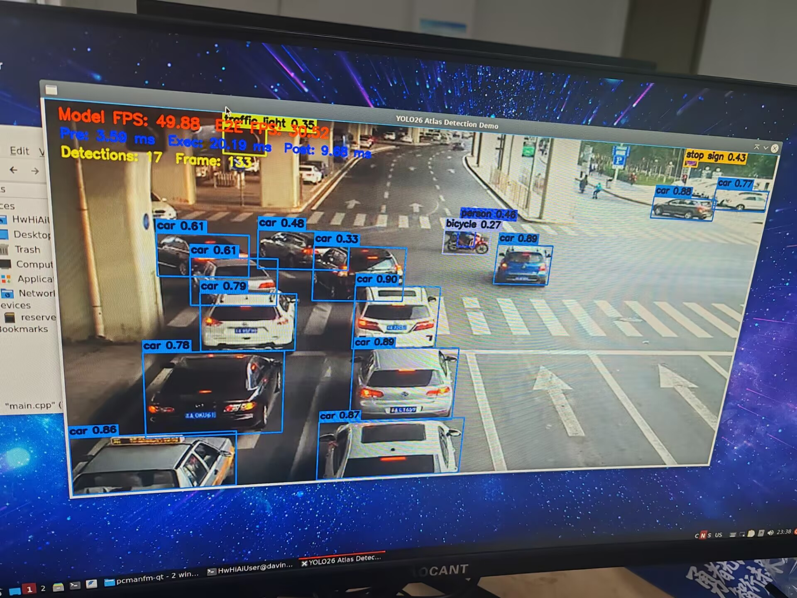
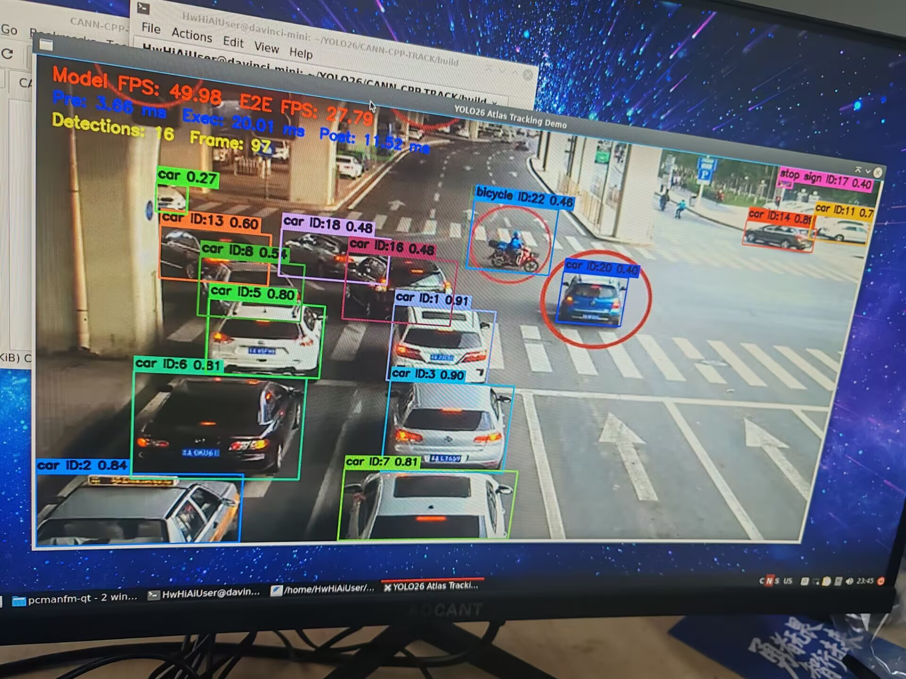

# yolo26-cann-cpp

<p align="left">
  
  
  
  
</p>

## Overview

This repository contains a practical C++ deployment project for **YOLO26** on **Huawei Atlas** devices using **CANN / AscendCL**. It currently supports **FP16 inference**, **AIPP-based preprocessing**, **pure detection**, **detection + tracking**, **video-file inference**, and **USB camera inference**.

## Example Results

| Detection | Tracking |
| --- | --- |
|  |  |

## Repository Structure

```text
yolo26-cann-cpp/
|-- CANN-CPP-DETECTION/
|   |-- CMakeLists.txt
|   `-- main.cpp
|-- CANN-CPP-TRACK/
|   |-- CMakeLists.txt
|   `-- main.cpp
|-- figs/
|   |-- detection.jpg
|   `-- tracking.jpg
|-- .gitignore
`-- README.md
```

## Requirements

This project requires a Huawei Atlas device with CANN Toolkit installed, plus OpenCV, CMake, and GCC/G++.

## Model Weights

Download the CANN `.om` model from [Google Drive](https://drive.google.com/file/d/1saF-3-yTGZoNJAgP1Gg8CqcY1rL6p_rT/view?usp=sharing).

After downloading, copy the model to that path on the Atlas device, or update `kModelPath` in:

* `CANN-CPP-DETECTION/main.cpp`
* `CANN-CPP-TRACK/main.cpp`

## Build

### Detection

```bash
cd CANN-CPP-DETECTION
mkdir -p build
cd build
cmake ..
make -j4
```

### Tracking

```bash
cd CANN-CPP-TRACK
mkdir -p build
cd build
cmake ..
make -j4
```

## Quick Start

### 1. Video-file inference

In `main.cpp`, set:

```cpp
const std::string kVideoSource = "/path/to/your/video.mp4";
```

Then run:

```bash
./yolo26_acl_demo
```

### 2. USB camera inference

In `main.cpp`, set:

```cpp
const std::string kVideoSource = "0";
```

This uses the default webcam device, typically `/dev/video0`.

If needed, camera resolution can be set after `cap.open()` in OpenCV.

## AIPP Notes

The current deployment path uses static AIPP preprocessing. A common configuration for this project is:

```text
aipp_op {
    aipp_mode: static
    input_format: RGB888_U8
    csc_switch: false
    src_image_size_w: 640
    src_image_size_h: 640

    mean_chn_0: 0
    mean_chn_1: 0
    mean_chn_2: 0
    var_reci_chn_0: 0.003921568627
    var_reci_chn_1: 0.003921568627
    var_reci_chn_2: 0.003921568627
}
```

This corresponds to mapping input RGB values from `[0, 255]` into `[0, 1]`.

## CMake Notes

The project expects:

* OpenCV from the local system installation
* Ascend headers and libraries from local CANN installation
